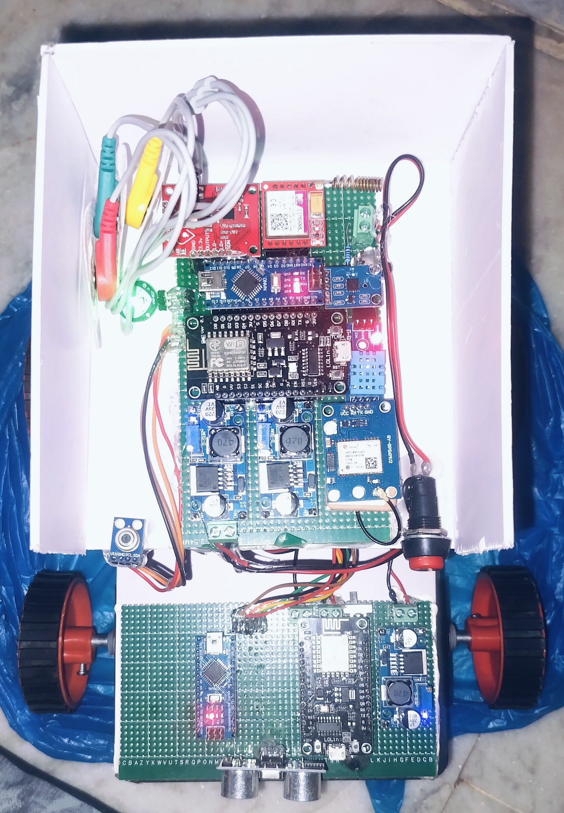

# 🦽 Smart Assistive Chair

A Smart Assistive Chair designed to support individuals with disabilities by providing **real-time activity monitoring, health-related monitoring, and Wi-Fi-based chair movement control**.

The system combines IoT sensors, microcontrollers, motor control, and a web-based control interface to improve user safety, mobility, and independence.

---

## 📌 Project Overview

The Smart Assistive Chair addresses the challenge of monitoring and assisting individuals who may require continuous support.

The system collects sensor data related to movement, posture, and health parameters. The collected data is processed by the microcontroller, and abnormal conditions can trigger alerts.

In addition, the chair can be controlled through a Wi-Fi-based web application. The user can send movement commands such as:

* ⬆️ Forward
* ⬇️ Backward
* ⬅️ Left
* ➡️ Right
* 🛑 Stop

---

## 🎯 Objectives

* Monitor user activity in real time
* Detect abnormal conditions using sensor readings
* Provide timely alerts for abnormal conditions
* Enable Wi-Fi-based chair movement control
* Improve safety and independence of users
* Provide a simple and user-friendly control interface

---

## ⚙️ System Architecture

```text
                ┌─────────────────────┐
                │     IoT Sensors     │
                │ Movement / Health   │
                └──────────┬──────────┘
                           │
                           ▼
                ┌─────────────────────┐
                │   Microcontroller   │
                │ Arduino / ESP8266   │
                └──────────┬──────────┘
                           │
                 ┌─────────┴─────────┐
                 │                   │
                 ▼                   ▼
        ┌────────────────┐   ┌────────────────┐
        │ Health /       │   │ Wi-Fi Movement │
        │ Activity Data  │   │ Control        │
        └───────┬────────┘   └───────┬────────┘
                │                    │
                ▼                    ▼
        ┌──────────────┐      ┌───────────────┐
        │ Monitoring / │      │ Motor Driver  │
        │ Alert System │      └───────┬───────┘
        └──────────────┘              │
                                      ▼
                              ┌───────────────┐
                              │ Chair Motors  │
                              └───────────────┘
```

---

## 🛠️ Technologies Used

### Software

* HTML
* CSS
* JavaScript
* Arduino IDE
* Embedded C/C++
* ESP8266

### Hardware

* Arduino
* ESP8266 NodeMCU
* Ultrasonic sensor
* IoT/health monitoring sensors
* Motor driver
* DC motors
* Battery
* Wi-Fi hotspot/network

> Add or remove hardware components here based on the exact components used in your final prototype.

---

## 🚗 Wi-Fi-Based Movement Control

The chair uses a Wi-Fi communication system for movement control.

A mobile hotspot creates the local Wi-Fi network. The ESP8266 connects to the network and communicates with the control application.

The application sends movement commands to the controller.

### Movement Commands

| Command | Movement |
| ------- | -------- |
| `f`     | Forward  |
| `b`     | Backward |
| `l`     | Left     |
| `r`     | Right    |
| `s`     | Stop     |

The Arduino code in this repository implements these commands and controls the two motors accordingly.

---

## 🌐 How Wi-Fi Control Works

```text
Mobile Hotspot
      ↓
ESP8266 connected to Wi-Fi
      ↓
Controller IP Address
      ↓
Web Control Application
      ↓
Movement Command
      ↓
ESP8266 / Arduino
      ↓
Motor Driver
      ↓
DC Motors
      ↓
Chair Movement
```

The controller receives the movement command through the Wi-Fi connection and the Arduino controls the motor pins based on the received command. The repository's movement code uses separate motor-control pins and receives commands through the ESP8266 serial connection.

---

## 🧠 Movement Logic

### Forward

Both motors rotate in the forward direction.

### Backward

Both motors rotate in the reverse direction.

### Left

The two motors are driven in opposite directions to turn the chair towards the left.

### Right

The two motors are driven in opposite directions to turn the chair towards the right.

### Stop

The motor control pins are set LOW to stop the motors.

---

## 📊 Sensor Monitoring

The system collects sensor readings related to user activity and health monitoring.

Because sensor values can fluctuate and may not always be perfectly accurate, threshold values are used to determine whether a reading should be considered normal or abnormal.

```text
Sensor Reading
      ↓
Compare with Threshold
      ↓
 ┌────┴────┐
 │         │
Normal   Abnormal
 │         │
 ↓         ↓
Continue   Alert
Monitoring
```

---

## 🚨 Alert Mechanism

When a monitored parameter crosses its predefined threshold, the system can identify the condition as abnormal and trigger the appropriate alert mechanism.

This approach helps reduce false alerts caused by small fluctuations in sensor readings.

---

## 💻 Web Control Application

The web application provides a simple interface for controlling the chair.

JavaScript is used to handle user interactions and trigger the appropriate movement commands.

For example:

```text
User clicks Forward
        ↓
JavaScript event
        ↓
Forward command
        ↓
Controller IP
        ↓
Wi-Fi
        ↓
Motor control
        ↓
Chair moves forward
```

---

## 🗂️ Repository Structure

```text
Smart-assistive-chair/
│
├── Arduino Code_ IoT based Healthcare Monitoring
│
├── Arduino Code_WiFi Controlled Robot
│
├── ESP8266 NodeMCU
│
├── ESP8266 NodeMCU Code_IoT based Healthcare Monitoring
│
├── Project components.pdf
│
├── Image.jpg
│
├── IMG20251229215450.jpg
│
└── README.md
```

The repository currently contains these project files and images.

---

## 🧩 Challenges Faced

### 1. Inaccurate Sensor Readings

One challenge was that sensor values were sometimes inconsistent or fluctuated even when the actual condition had not changed.

### Solution

We used threshold values instead of depending on a single exact reading. The sensor value was compared with a predefined threshold, and the system responded when the value crossed the appropriate limit.

We tested the readings multiple times and adjusted the threshold values to improve reliability.

### 2. Wi-Fi Communication

Another challenge was establishing reliable communication between the web application and the controller.

### Solution

We connected the devices to the same Wi-Fi hotspot and used the controller's IP address for communication. We tested the commands individually and verified the response of the motors.

---

## 👨‍💻 My Contribution

My major contribution was on the **web-based control and movement-control side** of the project.

I worked on:

* Web-based control interface
* JavaScript event handling
* Movement commands
* Wi-Fi-based communication
* Forward, backward, left, and right controls
* Testing and debugging
* Integration between the application and hardware

---

## 📸 Project Images

### Prototype



### Project Setup


---

## 📊 Database / Monitoring

The project includes IoT-based monitoring of sensor data.

> **Note:** Add your actual ThingSpeak dashboard screenshot here if you have access to the project channel.

Example:

```markdown

```

---

## 🚀 Future Enhancements

* Mobile application for easier control
* Improved sensor calibration
* More accurate real-time health monitoring
* GPS-based location tracking
* Emergency notification to caregivers
* Cloud-based monitoring dashboard
* Voice-controlled movement
* Obstacle avoidance
* Improved security for Wi-Fi communication

---

## 🎓 Project Outcome

The Smart Assistive Chair demonstrates how IoT, embedded systems, sensors, Wi-Fi communication, and web technologies can be combined to create an assistive solution.

The project helped us gain practical experience in hardware-software integration, real-time monitoring, web development, debugging, and problem-solving.

---

## 👥 Project Type

**Academic Major Project**

### Domain

IoT | Assistive Technology | Healthcare | Embedded Systems | Web Development

---

## 🔗 Repository

[Smart Assistive Chair – GitHub](https://github.com/Mansoorsk12/Smart-assistive-chair)
